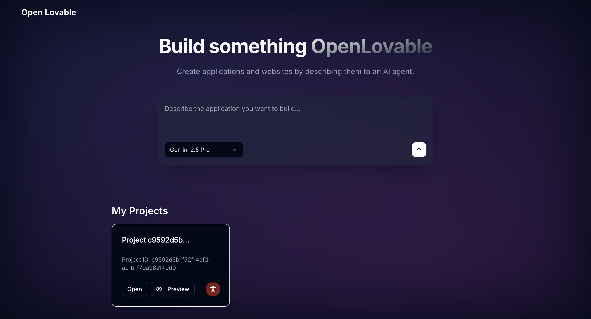
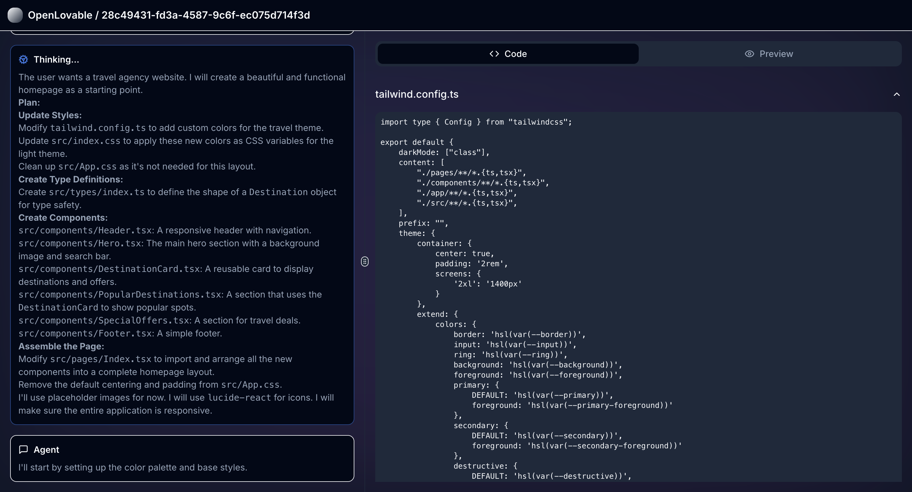
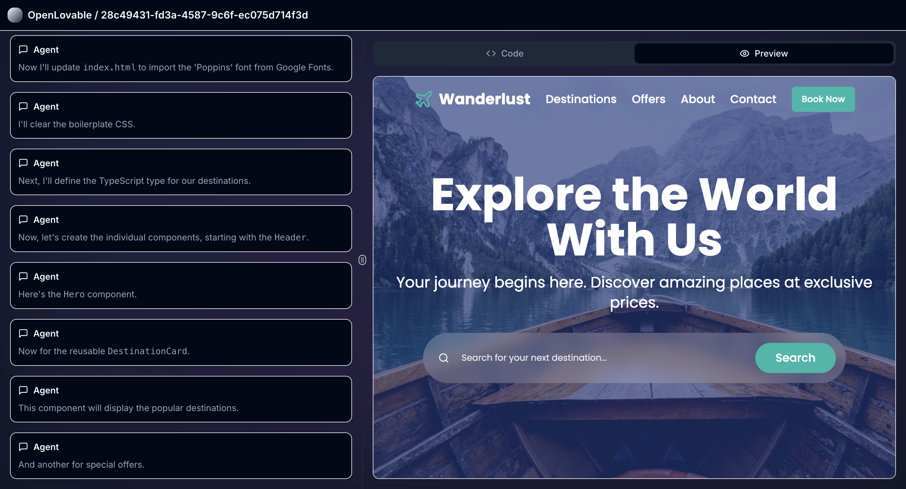

# 🚀 Open Lovable

**Build something lovable, just by talking to it.**

Open Lovable is an open-source, AI-driven web application builder. It's a "no-code" tool with a conversational interface, allowing you to describe the application you want to build, and watch as an AI agent writes the code, sets up the files, and brings your vision to life in real time.

## 📸 Demo Screenshots

### Dashboard


### AI Agent in Action


### Live Preview


### Generated Website Example


## ✨ Vision

The goal of Open Lovable is to dramatically accelerate the software development process. Instead of manually writing boilerplate, setting up components, and wrestling with CSS, you can act as the architect. You provide the high-level vision through prompts, and the Lovable Agent acts as your expert full-stack developer, handling the implementation details.

This project is built on the belief that AI should be a collaborative partner in creation, making development more accessible, faster, and more fun.

## 🛠️ How It Works

Open Lovable combines a frontend built with Vite and React with a local backend powered by Bun and ElysiaJS. **All data is stored locally** using browser localStorage.

1.  **Prompt:** You describe what you want to build on the homepage (e.g., "a beautiful todo application").
2.  **API Key:** Set your Gemini API key in the browser UI (stored securely in localStorage).
3.  **AI Generation:** Your prompt, combined with a carefully crafted system prompt, is sent to the Google Gemini API.
4.  **Live Parsing:** The AI's response, which is a stream of structured commands and code, is parsed in real-time on the frontend.
5.  **Local Storage:** The generated files and project data are stored in browser localStorage (5-10 MB per domain).
6.  **UI Updates:** As the parser identifies commands (`<lov-write>`, `<lov-rename>`, etc.), it updates the UI to show you the agent's plan and the code being generated.
7.  **Persistence:** Projects remain in localStorage until you delete them, allowing you to reopen and continue editing anytime.

## 💻 Tech Stack

-   **Frontend:** React, TypeScript, Vite, Tailwind CSS
-   **UI Components:** [shadcn/ui](https://ui.shadcn.com/)
-   **Backend:** Bun, [ElysiaJS](https://elysiajs.com/)
-   **AI:** Google Gemini API (supports multiple models: `gemini-2.0-flash`, `gemini-2.5-flash`, `gemini-2.5-pro`)
-   **State Management:** Zustand
-   **API Communication:** Axios, Native Web Streams API

## 🚀 Getting Started

Follow these steps to get Open Lovable running on your local machine.

### Prerequisites

-   [Bun](https://bun.sh/) installed on your system.
-   A Google Gemini API Key. You can get one from the [Google AI Studio](https://aistudio.google.com/app/apikey).
-   Billing enabled on your Google Cloud project associated with the API key.

### Installation & Setup

1.  **Clone the repository:**
    ```bash
    git clone https://github.com/your-username/openlovable.git
    cd openlovable
    ```

2.  **Install dependencies:**
    ```bash
    bun install
    ```

3.  **Set up your environment variables:**
    -   Create a new file named `.env` in the root of the project.
    -   Add your Gemini API key to this file:
        ```
        GEMINI_API_KEY="your_google_api_key_here"
        ```

4.  **Run the application:**
    -   This single command starts both the frontend Vite server and the backend ElysiaJS server concurrently.
    ```bash
    bun run dev
    ```

5.  **Open your browser:**
    -   Navigate to `http://localhost:8080` (or whatever port Vite announces). You should see the Open Lovable homepage.

## ✨ Features

- **🤖 AI-Powered Development:** Describe your app and watch AI build it
- **📱 Live Preview:** See your application update in real-time as code is generated
- **📁 Project Management:** Dashboard to manage multiple projects locally
- **🔄 Real-time Streaming:** Watch the AI agent think and code in real-time
- **🎨 Modern UI:** Clean, responsive interface built with Tailwind CSS and shadcn/ui
- **🔧 Multiple AI Models:** Choose from Gemini 2.0 Flash, 2.5 Flash, or 2.5 Pro
- **💾 Local Storage:** All projects stored in browser localStorage, no backend database needed
- **🔔 Toast Notifications:** Real-time feedback on every operation
- **🔐 Privacy-First:** All data stays on your device, no cloud sync

## 🗺️ Project Roadmap

Open Lovable is actively being developed. Here are some of the features and improvements planned:

-   [x] **Live Preview:** An `<iframe>` panel that shows a real-time, sandboxed preview of the generated application as the code is written.
-   [ ] **Interactive Editing:** Allow users to click on elements in the preview to inspect and modify their properties.
-   [ ] **Follow-up Prompts:** Implement a chat interface to allow for iterative development ("Now, change the color of the primary button to blue").
-   [x] **Dependency Management:** Handle `<lov-add-dependency>` commands to automatically install new packages with `bun add`.
-   [ ] **Deployment:** A one-click button to deploy the generated project to a hosting provider like Vercel or Netlify.
-   [x] **Model Flexibility:** Allow users to choose between different AI models.
-   [ ] **Export Projects:** Download generated projects as ZIP files
-   [ ] **Template Library:** Pre-built templates for common application types

## 🤝 Contributing

We welcome contributions! Whether you want to:

- 🐛 Report bugs
- 💡 Suggest new features  
- 📝 Improve documentation
- 🔧 Submit code changes

Please feel free to open an issue or submit a pull request.

### Development Setup

1. Fork the repository
2. Create a feature branch: `git checkout -b feature/amazing-feature`
3. Make your changes and test them
4. Commit your changes: `git commit -m 'Add amazing feature'`
5. Push to the branch: `git push origin feature/amazing-feature`
6. Open a Pull Request

## 📄 License

This project is open-source and licensed under the MIT License. See the [LICENSE](LICENSE) file for details.

## 🙏 Acknowledgments

- Built with [Google Gemini AI](https://ai.google.dev/)
- UI components from [shadcn/ui](https://ui.shadcn.com/)
- Powered by [Bun](https://bun.sh/) and [Vite](https://vitejs.dev/)

---

**Made with ❤️ by AniketDandgavhan for Community**
